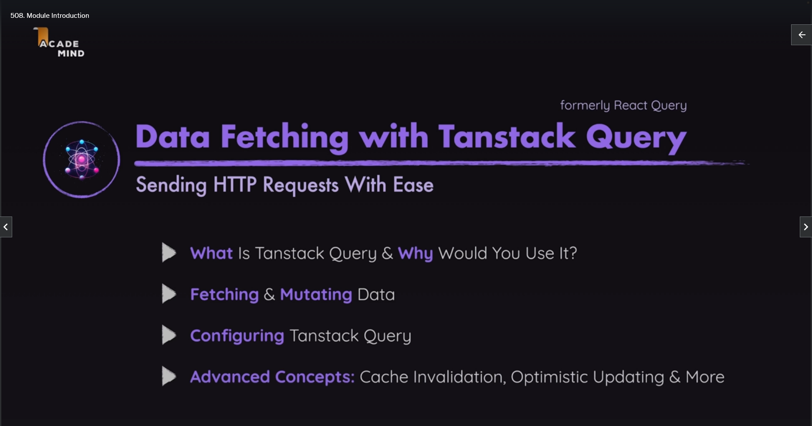
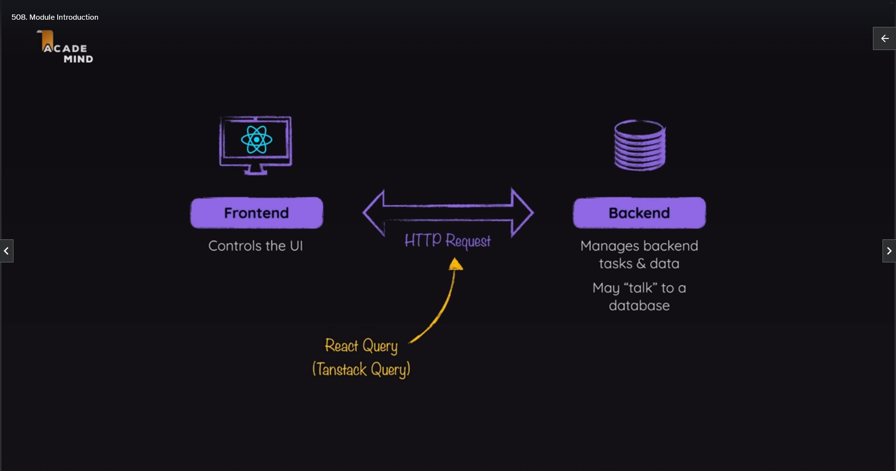
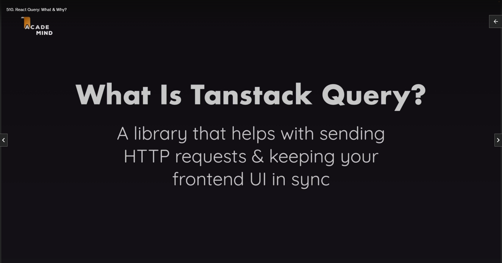
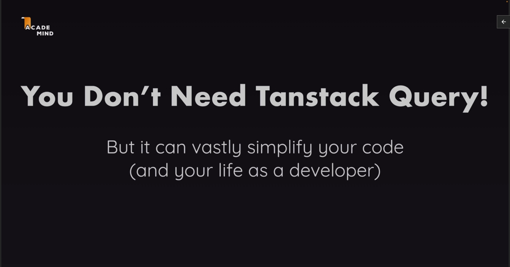
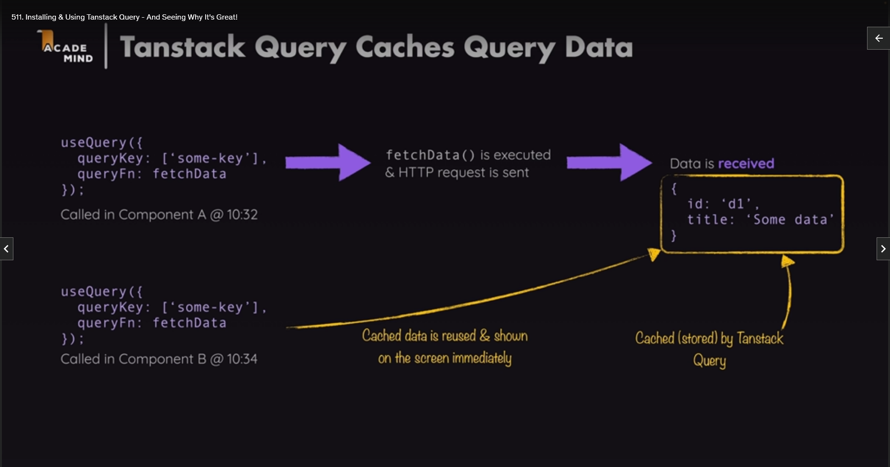

# TanStack Query

## Module Introduction





In this section, we're going to work on yet another new project, and whilst working on this project, you will learn how to use `TanStack Query`, a third-party React library, formerly known as `TanStack Query`, so that's its old name, the new name is `TanStack Query`, and it is a library that helps you with sending HTTP requests from inside your React app. So it helps you with connecting your React frontend to a backend.

Now, of course, in this course, you already learned how to do that, for example, with useEffect and using the built-in fetch function that's provided by the browser, but in this section here, you will learn what exactly `TanStack Query` is, and most importantly, why you would use it instead of using `useEffect` and `fetch`, for example.

And you will then learn how to use this `TanStack Query` library to fetch data and to mutate data, so how to send, get, and post, and put, and delete requests, and all these things. You will learn how to configure and efficiently use this library, and we will also explore many more advanced concepts like working with the cache that's provided by that library, how it works, and how you can invalidate and change it.

We'll explore the topic of optimistic updating, what that is, and how you would implement it with `TanStack Query`, and much more.

## TanStack Query: What & Why?





Before we delve into utilizing `TanStack Query` in this project, it's crucial that we all have a clear understanding of what `TanStack Query` is and the reasons for considering its use. As highlighted in the initial video of this section, `TanStack Query` serves as a library designed to facilitate the management of HTTP requests and ensure synchronization between the frontend user interface and backend data.

The fundamental concept revolves around sending HTTP requests and maintaining coherence between the frontend and backend. It's essential to note that while `TanStack Query` streamlines this process, it is not a prerequisite. Achieving the same result is feasible using tools like the `useEffect` hook and the `fetch` function, as demonstrated earlier in this course.

`TanStack Query`, however, offers a significant advantage in simplifying code, potentially enhancing the developer's experience. This is particularly notable due to the library's inclusion of numerous built-in advanced features. These features prove invaluable for more intricate React applications, addressing challenges that would otherwise be laborious to tackle independently.

In the repository, specifically within the `src/components/Events` directory, you'll encounter a component named `NewEventsSection`. In the corresponding file, the useEffect hook is employed to execute code responsible for sending an HTTP request to the backend and retrieving events data. The component manages states for data, potential errors, and loading indicators to update the UI accordingly.

```jsx
// src/components/Events/NewEventsSection.jsx

import { useEffect, useState } from "react";

import LoadingIndicator from "../UI/LoadingIndicator.jsx";
import ErrorBlock from "../UI/ErrorBlock.jsx";
import EventItem from "./EventItem.jsx";

export default function NewEventsSection() {
  const [data, setData] = useState();
  const [error, setError] = useState();
  const [isLoading, setIsLoading] = useState(false);

  useEffect(() => {
    async function fetchEvents() {
      setIsLoading(true);
      const response = await fetch("http://localhost:4000/events");

      if (!response.ok) {
        const error = new Error("An error occurred while fetching the events");
        error.code = response.status;
        error.info = await response.json();
        throw error;
      }

      const { events } = await response.json();

      return events;
    }

    fetchEvents()
      .then((events) => {
        setData(events);
      })
      .catch((error) => {
        setError(error);
      })
      .finally(() => {
        setIsLoading(false);
      });
  }, []);

  let content;

  if (isLoading) {
    content = <LoadingIndicator />;
  }

  if (error) {
    content = (
      <ErrorBlock title="An error occurred" message="Failed to fetch events" />
    );
  }

  if (data) {
    content = (
      <ul className="events-list">
        {data.map((event) => (
          <li key={event.id}>
            <EventItem event={event} />
          </li>
        ))}
      </ul>
    );
  }

  return (
    <section className="content-section" id="new-events-section">
      <header>
        <h2>Recently added events</h2>
      </header>
      {content}
    </section>
  );
}
```

While this approach utilizing React's built-in features is entirely valid, it does present potential flaws. The code can be extensive, requiring meticulous state management within each component handling HTTP requests. Even with the possibility of simplification through custom hooks, certain features may be missing or problematic.

For instance, the current code lacks a mechanism for triggering a refetch when returning to the website after navigating to a different tab. Additionally, the absence of caching functionality could result in redundant data fetching when switching between pages, hindering the user experience. Implementing these features from scratch demands significant effort and precision.

This is where `TanStack Query` becomes instrumental. The library not only streamlines existing code, such as state management, but also introduces advanced features like caching and automatic data fetching upon revisiting the website. These subtle enhancements contribute to a more efficient and user-friendly application. Now, let's embark on our journey with `TanStack Query` to leverage its capabilities and improve our app.

## Install & Using TanStack Query - And Seeing Why It's Great!

Install `TanStack Query` with `npm install @tanstack/react-query`

We will change the code in `src/components/Events/NewEventsSection.jsx` to make use of `TanStack Query`

We move the `fetch` from inside the `useEffect` out of the Component and into a new `http.js` in a new `util` subfolder
We remove the `setIsLoading(true);` from the `fetch`

```js
// src/util/http.js

export async function fetchEvents() {
  const response = await fetch("http://localhost:4000/events");

  if (!response.ok) {
    const error = new Error("An error occurred while fetching the events");
    error.code = response.status;
    error.info = await response.json();
    throw error;
  }

  const { events } = await response.json();

  return events;
}
```

We remove the `3 states` and the `useEffect` from `src/components/Events/NewEventsSection.jsx`

We can now use `TanStack Query`
We import `useQuery` a custom hook built by the `TanStack Query` team

Now we can use the `useQuery` hook in the `src/components/Events/NewsEventsSection.jsx` Component

And this hook will behind the scenes send an HTTP Request and get us the Events Data that we need in this section
And also give us information about the current Loading state and potential Errors
To do that we must configure this `useQuery` hook
We pass an Object to `useQuery` and in this object we can set various properties
One of which is the `queryFn` (Query Function) property
With this Function you define the actual code that will send the actual HTTP Request

`TanStack Query` does not come with some built in logic to send HTTP Requests
Instead it comes with logic for managing those requests
For keeping track of the data and the possible errors that are yielded by these requests and so on

The code for sending the requests must come from your side, you define that code, and you can define that code however you want
All `useQuery` `queryFn` wants is a function that returns a `Promise`

We can now import the `fetchEvents` function we moved to the `utils/http.js`

And use it as our `queryFn` value
So `fetchEvents` will be executed by `TanStack Query` to fetch the data

There is another property we should add, the `queryKey` property
When using `useQuery` every query, every fetch request, also should have a `queryKey` which will internally be used by `TanStack Query` to cache the data that's yielded by that request
So that the response from that request could be re-used in the future if you are trying to send the same request again



You can configure how long data should be stored and reused by `TanStack Query`
This is an important mechanism because data can be shown to the user quicker if you already have it because it doesn't need to be refetched all the time
So that's why every query needs a `queryKey` and that key is actually an array
And array of values that are internally stored by `TanStack Query` such that whenever you are using a similar array of similar values `TanStack Query` sees that and is able to re-use existing data
For now we will use `queryKey: ["events"]`
But the `queryKey` can contain multiple values and you are not limited to just using strings, you can use objects or nested arrays etc

And we will get back an object from `useQuery` and we can use object destructuring to pull out the elements that are most important to us
We can pull out the `data` property from that object returned by `useQuery`.
`data` is holds the actual response data
`isPending` tells us whether the request is currently on its way, or we have a response
`isError` tells us whether the response is an error, (!) your request code must therefore make sure an error is thrown
`error` we get back an error which contains the error information, eg. the error message
there are other properties like `refetch` function which could in theory be called manually to send the same query again

```jsx
// src/components/Events/NewsEventsSection.jsx

// import `TanStack Query`
import { useQuery } from "@tanstack/react-query";

import LoadingIndicator from "../UI/LoadingIndicator.jsx";
import ErrorBlock from "../UI/ErrorBlock.jsx";
import EventItem from "./EventItem.jsx";

// import fetchEvents
import { fetchEvents } from "../../util/http.js";

export default function NewEventsSection() {
  // useQuery Hook and destructure the relevant properties
  const { data, isPending, isError, error } = useQuery({
    // provide a Query Function
    queryFn: fetchEvents,
    // define a Query Key
    queryKey: ["events"],
  });

  let content;

  // isPending from useQuery
  if (isPending) {
    content = <LoadingIndicator />;
  }

  // isError from useQuery
  if (isError) {
    content = (
      <ErrorBlock
        title="An error occurred"
        // use the error message from the fetchEvents
        message={error.info?.message || "Failed to fetch events."}
      />
    );
  }

  // data from useQuery
  if (data) {
    content = (
      <ul className="events-list">
        {data.map((event) => (
          <li key={event.id}>
            <EventItem event={event} />
          </li>
        ))}
      </ul>
    );
  }

  return (
    <section className="content-section" id="new-events-section">
      <header>
        <h2>Recently added events</h2>
      </header>
      {content}
    </section>
  );
}
```

In order to use the `useQuery` Hook you must wrap the components that want to use these features with a special provider component in `TanStack Query`
We will do that in `/src/App.jsx`

We import `QueryClientProvider` and `QueryClient`

We instantiate a `new QueryClient` as `queryClient`
We wrap the `QueryClientProvider` around our Router
And we pass the `client` prop our `queryClient` we created

Now the App has the ability to use `TanStack Query` everywhere
We can notice TanStack automatically refetches on window refocus

```jsx
// src/App.jsx

import {
  Navigate,
  RouterProvider,
  createBrowserRouter,
} from "react-router-dom";

// import the QueryClientProvider and QueryClient
import { QueryClientProvider, QueryClient } from "@tanstack/react-query";

import Events from "./components/Events/Events.jsx";
import EventDetails from "./components/Events/EventDetails.jsx";
import NewEvent from "./components/Events/NewEvent.jsx";
import EditEvent from "./components/Events/EditEvent.jsx";

const router = createBrowserRouter([
  {
    path: "/",
    element: <Navigate to="/events" />,
  },
  {
    path: "/events",
    element: <Events />,

    children: [
      {
        path: "/events/new",
        element: <NewEvent />,
      },
    ],
  },
  {
    path: "/events/:id",
    element: <EventDetails />,
    children: [
      {
        path: "/events/:id/edit",
        element: <EditEvent />,
      },
    ],
  },
]);

// instantiate a new Query Client
const queryClient = new QueryClient();

function App() {
  return (
    // the QueryClientProvider wraps the Router, and set the client prop to the Query Client we created above
    <QueryClientProvider client={queryClient}>
      <RouterProvider router={router} />
    </QueryClientProvider>
  );
}

export default App;
```

## Understanding & Configuring Query Behaviours - Cache & Stale Data

`TanStack Query` offers certain advantages, one super important feature would be `Caching`.

`TanStack Query` **caches response data**.

As a result, if we're on our website, we can, for example, go to a different page by clicking "View Details."
When we then go back by clicking "View All Events," the events here are available instantly.
This might seem obvious, but it is not.
Before, when we used `useEffect` and our own fetching logic, this was not the case.
There, if we went to a different page and came back, a brand new request was sent, and all the data was fetched again.
Now, with `TanStack Query`, the data is available instantly.

Though, if you take a look at the Network Tab, you will actually see that as I click on "View All Events," there is another request being sent.
Nonetheless, the data is available instantly.
Of course, these requests are all pretty fast because we're working locally, but we would still see that data instantly even if the request were a bit slower.

We can easily simulate this by going to the Network Tab in the Developer Tools, throttling this a little bit, and selecting "Slow 3G."
With that enabled, you'll see that still, if I go back to "View All Events," the data is available instantly.
Just the images were not available instantly because those, of course, still had to be re-fetched.
These are not fetched by useQuery and not cached by `TanStack Query`.
Instead, these are simply included through links and fetched by the browser.
But you saw that despite these images being re-fetched, the other data was available instantly, and now even the images were cached.
That's really important to understand.

There is another request being sent behind the scenes here, but this is not the request that's needed to display data instantly.

Instead, `TanStack Query` caches the response data you are getting back from your requests, and it will reuse that data whenever it encounters a new `useQuery` execution with the same `Query Key`.

For example, if we go back to this page and, therefore, this component function executes again, `TanStack Query` will see that this `Query Key` has been used before and that it did already cache data for that key.
It will then instantly yield that data but at the same time, also send this request again behind the scenes to see if updated data is available.
It will silently replace that data with the updated data so that after a couple of seconds or however long it takes to fetch that data, we have the updated data on the screen.
This way, we get the best of both worlds: instant results but still updated data once this behind-the-scenes request is done.

As a developer using `TanStack Query`, you can control if this is the behaviour you want.
For example, by setting a `staleTime` on your queries.
This controls after which time `TanStack Query` will send such a behind-the-scenes request to get updated data if it found data in your cache.
The default is zero, which means it will use data from the cache but will always also send such a behind-the-scenes request to get updated data.
If you set this to 5,000, for example, it will wait for 5,000 milliseconds before sending another request.
So, if this component was rendered and, therefore, this request was sent, and within five seconds this component is rendered again, and the same request would need to be sent, `TanStack Query` would not send it if the `staleTime` is set to 5,000.

```jsx
const { data, isPending, isError, error } = useQuery({
  queryFn: fetchEvents,
  queryKey: ["events"],
  // wait for 5000 milliseconds before sending another request
  staleTime: 5000,
});
```

You can see this in your application if you go back to the page and if you reload it and then click "View Details" within five seconds, click on "View All Events," no Events Request was sent.
If you wait for more than five seconds and go somewhere else and come back, this Events Request is being sent.
That's the `staleTime` with which you can make sure that no unnecessary requests are sent.
As mentioned, the default is zero, but you can set this to whatever you want.

Another value you can set here is the `gcTime`, the `Garbage Collection Time`.
This controls how long the data and the cache will be kept around.
The default here is five minutes.
You could, of course, also reduce this, for example, to half a minute, with 30,000 milliseconds.
This would mean that the cached data would only be kept around for half a minute and thereafter, it would be discarded.
So, if this component needs to render again, there would be no cached data, and therefore, `TanStack Query` would always need to send a new request to get some data before it can show anything.

```jsx
const { data, isPending, isError, error } = useQuery({
  queryFn: fetchEvents,
  queryKey: ["events"],
  // how long the cache will be kept
  gcTime: 30000,
});
```

If we reduce `gcTime` to one second for example, as a result, if we load this page, we need to send the request and wait for the data.
But if we then go somewhere else and come back, the data was not there, which becomes even clearer if we throttle it.
First we reload this, then we'll throttle it, and now we'll go somewhere else and then come back.
Now you see, there's this loading spinner because now no data was there, and we did not just send some behind-the-scenes request; instead, this request was now actually needed to show anything at all because the cache was cleared because of this setting.

**We can control how long data is kept around in cache.**
We are exploring these topics in great depth here because this is one of the main features of `TanStack Query`: **being able to control how long data is kept around and when new requests will be sent.**

## Dynamic Query Functions & Query Keys

In the `src/components/Events/FindEventSection.jsx` we have a search bar.
The goal is to allow us to enter anything into that search bar and then find events that meet our search criteria.
So for example events that contain the word "city" in their title or description.
At the moment we just have some logic for potentially getting data out of that input with the help of that ref and for handling the submission of this form here.

```jsx
// src/components/Events/FindEventSection.jsx

import { useRef } from "react";

export default function FindEventSection() {
  const searchElement = useRef();

  function handleSubmit(event) {
    event.preventDefault();
  }

  return (
    <section className="content-section" id="all-events-section">
      <header>
        <h2>Find your next event!</h2>
        <form onSubmit={handleSubmit} id="search-form">
          <input
            type="search"
            placeholder="Search events"
            ref={searchElement}
          />
          <button>Search</button>
        </form>
      </header>
      <p>Please enter a search term and to find events.</p>
    </section>
  );
}
```

We should again import `useQuery` to send another query with the help of `TanStack Query`.
We again need a `queryFn` and `queryKey`.

For the `queryFn` we will still use the `fetchEvents` but we need to make it more flexible, so that if there is no search term it behaves as it did, but if there is a search term to include it with the request as a query parameter. This query parameter should only be added if if the fetchEvents is triggered from inside the `FindEventSection.jsx`. `fetchEvents` needs to accept `searchTerm` as a parameter. We can construct the url dynamically and optionally adding on a `searchTerm` as a query parameter.

```js
// src/util/http.js

export async function fetchEvents(searchTerm) {
  let url = "http://localhost:4000/events";

  // we add a way to dynamically append the url with the searchTerm
  if (searchTerm) {
    url += "?search=" + searchTerm;
  }

  const response = await fetch(url);

  if (!response.ok) {
    const error = new Error("An error occurred while fetching the events");
    error.code = response.status;
    error.info = await response.json();
    throw error;
  }

  const { events } = await response.json();

  return events;
}
```

In the `FindEventSection` component we can now configure the query.
The `queryFn` is again `fetchEvents` but we now must control how it will be called to make sure that the `searchTerm` that was entered in the `input` is forwarded to `fetchEvents`.

To do that we can wrap it in a function, an anonymous arrow function, and then pass the `value` that was entered into the input to `fetchEvents`. So we could say that here as a value for `fetchEvents` we wanna pass in `searchElement.current` since it's a `ref` that will be connected to this input, which will have such a `value` property. But if we're doing that, we'll have to make sure that this query is not sent before we do have a `searchTerm`.

Now let's setup the `queryKey` it should be `"events"` but it should be more than just that **because this is now a query that does not have the goal of fetching all events but instead only events that match our `searchTerm`.**

Now if we would use this `queryKey`, we would of course be using the same `queryKey` as in the `NewEventsSection` component. There we currently have exactly the same `queryKey`. And as a result of using the same key `TanStack Query` would actually use the result from this first query in the `NewEventsSection` component in that other query in that other component because the results are cached, they are available, and therefore they would be used here.

But that of course would be wrong because that would typically be too many results because typically we're searching for something that should only yield a couple of results, not all of them.

So we need a different `queryKey` here so that this query works independently from this query. And the results from this query in the `NewEventsSection` component are **not used** as results for this query in the `FindEventSection` component.

Therefore we should also include some other piece of information in that `queryKey`. And that other piece of information should be `dynamic` because it should be that `searchTerm` for which we're looking. So we could, for example, pass an object here to this key where we have a search property and then our dynamic search term as a value. Alternatively, we could also just pass our `searchTerm` as a dynamic value here. This is up to you, but here we'll go for this extra object to make it very clear which kind of other value we have in this `queryKey`.

And of course here we could again use this `ref` value. But using this `ref` value for `fetchEvents` and for this key is actually not ideal, because `ref`s, unlike `state` in React don't cause this component function to re-execute which means that as the value entered into the input here changes, this query is not updated and not sent again. But of course, we would wanna send it again to get new data if the user did enter a different search term.

Therefore, here in this component we will also manage some state with the `useState` hook and that state will be my `searchTerm`. So here we'll have a `searchTerm` state and a `setSearchTerm` state updating function. And our goal in `handleSubmit` is now to call `setSearchTerm` and to pass the `searchElement.current.value` a value to this state updating function so that my `searchTerm` is the value entered in this input field, but only after the form was submitted.

And now we can use this `searchTerm` state here and here to make sure that both `fetchEvents` as well as this `queryKey` are updated dynamically and lead to different queries being sent as this `searchTerm` changes.

With that, we'll then get back an object again though. And in there, we'll, of course, get back our `data`. We of course also get back `isPending` and `isError` and the `error` if we got one. And we can now use all these pieces of information to output something down here in this component.

Now to do that, we'll add a new variable here named `content`.

```jsx
// src/components/Events/FindEventSection.jsx

import { useRef, useState } from "react";
import { useQuery } from "@tanstack/react-query";
import { fetchEvents } from "../../util/http";
import LoadingIndicator from "../UI/LoadingIndicator";
import ErrorBlock from "../UI/ErrorBlock";
import EventItem from "../Events/EventItem";

export default function FindEventSection() {
  // we use ref to get the value of the search input
  const searchElement = useRef();

  // we create state to store the searchTerm
  const [searchTerm, setSearchTerm] = useState("");

  const { data, isPending, isError, error } = useQuery({
    // we create a dynamic Query Key
    queryKey: ["events", { search: searchTerm }],
    // we use an anonymous arrow function to call fetchEvents and pass it the searchTerm
    queryFn: () => fetchEvents(searchTerm),
  });

  function handleSubmit(event) {
    event.preventDefault();
    // we update the searchTerm on submit of the form
    setSearchTerm(searchElement.current.value);
  }

  // set an initial content value
  let content = <p>Please enter a search term and to find events.</p>;

  // content will adjust dynamically based on the useQuery

  if (isPending) {
    content = <LoadingIndicator />;
  }

  if (isError) {
    content = (
      <ErrorBlock
        title="An error occurred"
        message={error.info?.message || "Failed to fetch events"}
      />
    );
  }

  if (data) {
    content = (
      <ul className="events-list">
        {data.map((event) => (
          <li key={event.id}>
            <EventItem event={event} />
          </li>
        ))}
      </ul>
    );
  }

  return (
    <section className="content-section" id="all-events-section">
      <header>
        <h2>Find your next event!</h2>
        <form onSubmit={handleSubmit} id="search-form">
          <input
            type="search"
            placeholder="Search events"
            ref={searchElement}
          />
          <button>Search</button>
        </form>
      </header>
      {content}
    </section>
  );
}
```

## The Query Configuration Object & Aborting Requests

## Enabled & Disabled Queries

## Changing Data with Mutations

## Fetching More Data & Testing the Mutation

## Acting on Mutation Success & Invalidating Queries

## A Challenge! The Problem

## A Challenge! The Solution

## Disabling Automatic Refetching After Invalidations

## Enhancing the App & Repeating Mutation Concepts

## TanStack Query Advantages in Action

## Updating Data with Mutations

## Optimistic Updating

## Using the Query Key as Query Function Input

## TanStack Query & React Router
