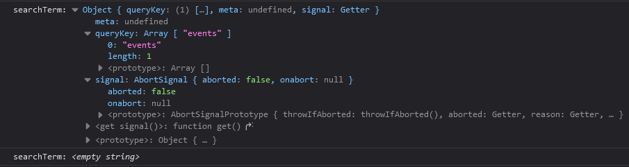

# TanStack Query

## 1. Module Introduction


In this section, we're going to work on yet another new project, and whilst working on this project, you will learn how to use `TanStack Query`, a third-party React library, formerly known as `TanStack Query`, so that's its old name, the new name is `TanStack Query`, and it is a library that helps you with sending HTTP requests from inside your React app. So it helps you with connecting your React frontend to a backend.

Now, of course, in this course, you already learned how to do that, for example, with useEffect and using the built-in fetch function that's provided by the browser, but in this section here, you will learn what exactly `TanStack Query` is, and most importantly, why you would use it instead of using `useEffect` and `fetch`, for example.

And you will then learn how to use this `TanStack Query` library to fetch data and to mutate data, so how to send, get, and post, and put, and delete requests, and all these things. You will learn how to configure and efficiently use this library, and we will also explore many more advanced concepts like working with the cache that's provided by that library, how it works, and how you can invalidate and change it.

We'll explore the topic of optimistic updating, what that is, and how you would implement it with `TanStack Query`, and much more.

## 3. TanStack Query: What & Why?


Before we delve into utilizing `TanStack Query` in this project, it's crucial that we all have a clear understanding of what `TanStack Query` is and the reasons for considering its use. As highlighted in the initial video of this section, `TanStack Query` serves as a library designed to facilitate the management of HTTP requests and ensure synchronization between the frontend user interface and backend data.

The fundamental concept revolves around sending HTTP requests and maintaining coherence between the frontend and backend. It's essential to note that while `TanStack Query` streamlines this process, it is not a prerequisite. Achieving the same result is feasible using tools like the `useEffect` hook and the `fetch` function, as demonstrated earlier in this course.

`TanStack Query`, however, offers a significant advantage in simplifying code, potentially enhancing the developer's experience. This is particularly notable due to the library's inclusion of numerous built-in advanced features. These features prove invaluable for more intricate React applications, addressing challenges that would otherwise be laborious to tackle independently.

In the repository, specifically within the `src/components/Events` directory, you'll encounter a component named `NewEventsSection`. In the corresponding file, the useEffect hook is employed to execute code responsible for sending an HTTP request to the backend and retrieving events data. The component manages states for data, potential errors, and loading indicators to update the UI accordingly.

```jsx
// src/components/Events/NewEventsSection.jsx

import { useEffect, useState } from "react";

import LoadingIndicator from "../UI/LoadingIndicator.jsx";
import ErrorBlock from "../UI/ErrorBlock.jsx";
import EventItem from "./EventItem.jsx";

export default function NewEventsSection() {
  const [data, setData] = useState();
  const [error, setError] = useState();
  const [isLoading, setIsLoading] = useState(false);

  useEffect(() => {
    async function fetchEvents() {
      setIsLoading(true);
      const response = await fetch("http://localhost:4000/events");

      if (!response.ok) {
        const error = new Error("An error occurred while fetching the events");
        error.code = response.status;
        error.info = await response.json();
        throw error;
      }

      const { events } = await response.json();

      return events;
    }

    fetchEvents()
      .then((events) => {
        setData(events);
      })
      .catch((error) => {
        setError(error);
      })
      .finally(() => {
        setIsLoading(false);
      });
  }, []);

  let content;

  if (isLoading) {
    content = <LoadingIndicator />;
  }

  if (error) {
    content = (
      <ErrorBlock title="An error occurred" message="Failed to fetch events" />
    );
  }

  if (data) {
    content = (
      <ul className="events-list">
        {data.map((event) => (
          <li key={event.id}>
            <EventItem event={event} />
          </li>
        ))}
      </ul>
    );
  }

  return (
    <section className="content-section" id="new-events-section">
      <header>
        <h2>Recently added events</h2>
      </header>
      {content}
    </section>
  );
}
```

While this approach utilizing React's built-in features is entirely valid, it does present potential flaws. The code can be extensive, requiring meticulous state management within each component handling HTTP requests. Even with the possibility of simplification through custom hooks, certain features may be missing or problematic.

For instance, the current code lacks a mechanism for triggering a refetch when returning to the website after navigating to a different tab. Additionally, the absence of caching functionality could result in redundant data fetching when switching between pages, hindering the user experience. Implementing these features from scratch demands significant effort and precision.

This is where `TanStack Query` becomes instrumental. The library not only streamlines existing code, such as state management, but also introduces advanced features like caching and automatic data fetching upon revisiting the website. These subtle enhancements contribute to a more efficient and user-friendly application. Now, let's embark on our journey with `TanStack Query` to leverage its capabilities and improve our app.

## 4. Install & Using TanStack Query - And Seeing Why It's Great!

Install `TanStack Query` with `npm install @tanstack/react-query`

We will change the code in `src/components/Events/NewEventsSection.jsx` to make use of `TanStack Query`

We move the `fetch` from inside the `useEffect` out of the Component and into a new `http.js` in a new `util` subfolder
We remove the `setIsLoading(true);` from the `fetch`

```js
// src/util/http.js

export async function fetchEvents() {
  const response = await fetch("http://localhost:4000/events");

  if (!response.ok) {
    const error = new Error("An error occurred while fetching the events");
    error.code = response.status;
    error.info = await response.json();
    throw error;
  }

  const { events } = await response.json();

  return events;
}
```

We remove the `3 states` and the `useEffect` from `src/components/Events/NewEventsSection.jsx`

We can now use `TanStack Query`
We import `useQuery` a custom hook built by the `TanStack Query` team

Now we can use the `useQuery` hook in the `src/components/Events/NewsEventsSection.jsx` Component

And this hook will behind the scenes send an HTTP Request and get us the Events Data that we need in this section
And also give us information about the current Loading state and potential Errors
To do that we must configure this `useQuery` hook
We pass an Object to `useQuery` and in this object we can set various properties
One of which is the `queryFn` (Query Function) property
With this Function you define the actual code that will send the actual HTTP Request

`TanStack Query` does not come with some built in logic to send HTTP Requests
Instead it comes with logic for managing those requests
For keeping track of the data and the possible errors that are yielded by these requests and so on

The code for sending the requests must come from your side, you define that code, and you can define that code however you want
All `useQuery` `queryFn` wants is a function that returns a `Promise`

We can now import the `fetchEvents` function we moved to the `utils/http.js`

And use it as our `queryFn` value
So `fetchEvents` will be executed by `TanStack Query` to fetch the data

There is another property we should add, the `queryKey` property
When using `useQuery` every query, every fetch request, also should have a `queryKey` which will internally be used by `TanStack Query` to cache the data that's yielded by that request
So that the response from that request could be re-used in the future if you are trying to send the same request again


You can configure how long data should be stored and reused by `TanStack Query`
This is an important mechanism because data can be shown to the user quicker if you already have it because it doesn't need to be refetched all the time
So that's why every query needs a `queryKey` and that key is actually an array
And array of values that are internally stored by `TanStack Query` such that whenever you are using a similar array of similar values `TanStack Query` sees that and is able to re-use existing data
For now we will use `queryKey: ["events"]`
But the `queryKey` can contain multiple values and you are not limited to just using strings, you can use objects or nested arrays etc

And we will get back an object from `useQuery` and we can use object destructuring to pull out the elements that are most important to us
We can pull out the `data` property from that object returned by `useQuery`.
`data` is holds the actual response data
`isPending` tells us whether the request is currently on its way, or we have a response
`isError` tells us whether the response is an error, (!) your request code must therefore make sure an error is thrown
`error` we get back an error which contains the error information, eg. the error message
there are other properties like `refetch` function which could in theory be called manually to send the same query again

```jsx
// src/components/Events/NewsEventsSection.jsx

// import `TanStack Query`
import { useQuery } from "@tanstack/react-query";

import LoadingIndicator from "../UI/LoadingIndicator.jsx";
import ErrorBlock from "../UI/ErrorBlock.jsx";
import EventItem from "./EventItem.jsx";

// import fetchEvents
import { fetchEvents } from "../../util/http.js";

export default function NewEventsSection() {
  // useQuery Hook and destructure the relevant properties
  const { data, isPending, isError, error } = useQuery({
    // provide a Query Function
    queryFn: fetchEvents,
    // define a Query Key
    queryKey: ["events"],
  });

  let content;

  // isPending from useQuery
  if (isPending) {
    content = <LoadingIndicator />;
  }

  // isError from useQuery
  if (isError) {
    content = (
      <ErrorBlock
        title="An error occurred"
        // use the error message from the fetchEvents
        message={error.info?.message || "Failed to fetch events."}
      />
    );
  }

  // data from useQuery
  if (data) {
    content = (
      <ul className="events-list">
        {data.map((event) => (
          <li key={event.id}>
            <EventItem event={event} />
          </li>
        ))}
      </ul>
    );
  }

  return (
    <section className="content-section" id="new-events-section">
      <header>
        <h2>Recently added events</h2>
      </header>
      {content}
    </section>
  );
}
```

In order to use the `useQuery` Hook you must wrap the components that want to use these features with a special provider component in `TanStack Query`
We will do that in `/src/App.jsx`

We import `QueryClientProvider` and `QueryClient`

We instantiate a `new QueryClient` as `queryClient`
We wrap the `QueryClientProvider` around our Router
And we pass the `client` prop our `queryClient` we created

Now the App has the ability to use `TanStack Query` everywhere
We can notice TanStack automatically refetches on window refocus

```jsx
// src/App.jsx

import {
  Navigate,
  RouterProvider,
  createBrowserRouter,
} from "react-router-dom";

// import the QueryClientProvider and QueryClient
import { QueryClientProvider, QueryClient } from "@tanstack/react-query";

import Events from "./components/Events/Events.jsx";
import EventDetails from "./components/Events/EventDetails.jsx";
import NewEvent from "./components/Events/NewEvent.jsx";
import EditEvent from "./components/Events/EditEvent.jsx";

const router = createBrowserRouter([
  {
    path: "/",
    element: <Navigate to="/events" />,
  },
  {
    path: "/events",
    element: <Events />,

    children: [
      {
        path: "/events/new",
        element: <NewEvent />,
      },
    ],
  },
  {
    path: "/events/:id",
    element: <EventDetails />,
    children: [
      {
        path: "/events/:id/edit",
        element: <EditEvent />,
      },
    ],
  },
]);

// instantiate a new Query Client
const queryClient = new QueryClient();

function App() {
  return (
    // the QueryClientProvider wraps the Router, and set the client prop to the Query Client we created above
    <QueryClientProvider client={queryClient}>
      <RouterProvider router={router} />
    </QueryClientProvider>
  );
}

export default App;
```

## 5. Understanding & Configuring Query Behaviours - Cache & Stale Data

`TanStack Query` offers certain advantages, one super important feature would be `Caching`.

`TanStack Query` **caches response data**.

As a result, if we're on our website, we can, for example, go to a different page by clicking "View Details."
When we then go back by clicking "View All Events," the events here are available instantly.
This might seem obvious, but it is not.
Before, when we used `useEffect` and our own fetching logic, this was not the case.
There, if we went to a different page and came back, a brand new request was sent, and all the data was fetched again.
Now, with `TanStack Query`, the data is available instantly.

Though, if you take a look at the Network Tab, you will actually see that as I click on "View All Events," there is another request being sent.
Nonetheless, the data is available instantly.
Of course, these requests are all pretty fast because we're working locally, but we would still see that data instantly even if the request were a bit slower.

We can easily simulate this by going to the Network Tab in the Developer Tools, throttling this a little bit, and selecting "Slow 3G."
With that enabled, you'll see that still, if I go back to "View All Events," the data is available instantly.
Just the images were not available instantly because those, of course, still had to be re-fetched.
These are not fetched by useQuery and not cached by `TanStack Query`.
Instead, these are simply included through links and fetched by the browser.
But you saw that despite these images being re-fetched, the other data was available instantly, and now even the images were cached.
That's really important to understand.

There is another request being sent behind the scenes here, but this is not the request that's needed to display data instantly.

Instead, `TanStack Query` caches the response data you are getting back from your requests, and it will reuse that data whenever it encounters a new `useQuery` execution with the same `Query Key`.

For example, if we go back to this page and, therefore, this component function executes again, `TanStack Query` will see that this `Query Key` has been used before and that it did already cache data for that key.
It will then instantly yield that data but at the same time, also send this request again behind the scenes to see if updated data is available.
It will silently replace that data with the updated data so that after a couple of seconds or however long it takes to fetch that data, we have the updated data on the screen.
This way, we get the best of both worlds: instant results but still updated data once this behind-the-scenes request is done.

As a developer using `TanStack Query`, you can control if this is the behaviour you want.
For example, by setting a `staleTime` on your queries.
This controls after which time `TanStack Query` will send such a behind-the-scenes request to get updated data if it found data in your cache.
The default is zero, which means it will use data from the cache but will always also send such a behind-the-scenes request to get updated data.
If you set this to 5,000, for example, it will wait for 5,000 milliseconds before sending another request.
So, if this component was rendered and, therefore, this request was sent, and within five seconds this component is rendered again, and the same request would need to be sent, `TanStack Query` would not send it if the `staleTime` is set to 5,000.

```jsx
const { data, isPending, isError, error } = useQuery({
  queryFn: fetchEvents,
  queryKey: ["events"],
  // wait for 5000 milliseconds before sending another request
  staleTime: 5000,
});
```

You can see this in your application if you go back to the page and if you reload it and then click "View Details" within five seconds, click on "View All Events," no Events Request was sent.
If you wait for more than five seconds and go somewhere else and come back, this Events Request is being sent.
That's the `staleTime` with which you can make sure that no unnecessary requests are sent.
As mentioned, the default is zero, but you can set this to whatever you want.

Another value you can set here is the `gcTime`, the `Garbage Collection Time`.
This controls how long the data and the cache will be kept around.
The default here is five minutes.
You could, of course, also reduce this, for example, to half a minute, with 30,000 milliseconds.
This would mean that the cached data would only be kept around for half a minute and thereafter, it would be discarded.
So, if this component needs to render again, there would be no cached data, and therefore, `TanStack Query` would always need to send a new request to get some data before it can show anything.

```jsx
const { data, isPending, isError, error } = useQuery({
  queryFn: fetchEvents,
  queryKey: ["events"],
  // how long the cache will be kept
  gcTime: 30000,
});
```

If we reduce `gcTime` to one second for example, as a result, if we load this page, we need to send the request and wait for the data.
But if we then go somewhere else and come back, the data was not there, which becomes even clearer if we throttle it.
First we reload this, then we'll throttle it, and now we'll go somewhere else and then come back.
Now you see, there's this loading spinner because now no data was there, and we did not just send some behind-the-scenes request; instead, this request was now actually needed to show anything at all because the cache was cleared because of this setting.

**We can control how long data is kept around in cache.**
We are exploring these topics in great depth here because this is one of the main features of `TanStack Query`: **being able to control how long data is kept around and when new requests will be sent.**

## 6. Dynamic Query Functions & Query Keys

In the `src/components/Events/FindEventSection.jsx` we have a search bar.
The goal is to allow us to enter anything into that search bar and then find events that meet our search criteria.
So for example events that contain the word "city" in their title or description.
At the moment we just have some logic for potentially getting data out of that input with the help of that ref and for handling the submission of this form here.

```jsx
// src/components/Events/FindEventSection.jsx

import { useRef } from "react";

export default function FindEventSection() {
  const searchElement = useRef();

  function handleSubmit(event) {
    event.preventDefault();
  }

  return (
    <section className="content-section" id="all-events-section">
      <header>
        <h2>Find your next event!</h2>
        <form onSubmit={handleSubmit} id="search-form">
          <input
            type="search"
            placeholder="Search events"
            ref={searchElement}
          />
          <button>Search</button>
        </form>
      </header>
      <p>Please enter a search term and to find events.</p>
    </section>
  );
}
```

We should again import `useQuery` to send another query with the help of `TanStack Query`.
We again need a `queryFn` and `queryKey`.

For the `queryFn` we will still use the `fetchEvents` but we need to make it more flexible, so that if there is no search term it behaves as it did, but if there is a search term to include it with the request as a query parameter. This query parameter should only be added if if the fetchEvents is triggered from inside the `FindEventSection.jsx`. `fetchEvents` needs to accept `searchTerm` as a parameter. We can construct the url dynamically and optionally adding on a `searchTerm` as a query parameter.

```js
// src/util/http.js

export async function fetchEvents(searchTerm) {
  let url = "http://localhost:4000/events";

  // we add a way to dynamically append the url with the searchTerm
  if (searchTerm) {
    url += "?search=" + searchTerm;
  }

  const response = await fetch(url);

  if (!response.ok) {
    const error = new Error("An error occurred while fetching the events");
    error.code = response.status;
    error.info = await response.json();
    throw error;
  }

  const { events } = await response.json();

  return events;
}
```

In the `FindEventSection` component we can now configure the query.
The `queryFn` is again `fetchEvents` but we now must control how it will be called to make sure that the `searchTerm` that was entered in the `input` is forwarded to `fetchEvents`.

To do that we can wrap it in a function, an anonymous arrow function, and then pass the `value` that was entered into the input to `fetchEvents`. So we could say that here as a value for `fetchEvents` we wanna pass in `searchElement.current` since it's a `ref` that will be connected to this input, which will have such a `value` property. But if we're doing that, we'll have to make sure that this query is not sent before we do have a `searchTerm`.

Now let's setup the `queryKey` it should be `"events"` but it should be more than just that **because this is now a query that does not have the goal of fetching all events but instead only events that match our `searchTerm`.**

Now if we would use this `queryKey`, we would of course be using the same `queryKey` as in the `NewEventsSection` component. There we currently have exactly the same `queryKey`. And as a result of using the same key `TanStack Query` would actually use the result from this first query in the `NewEventsSection` component in that other query in that other component because the results are cached, they are available, and therefore they would be used here.

But that of course would be wrong because that would typically be too many results because typically we're searching for something that should only yield a couple of results, not all of them.

So we need a different `queryKey` here so that this query works independently from this query. And the results from this query in the `NewEventsSection` component are **not used** as results for this query in the `FindEventSection` component.

Therefore we should also include some other piece of information in that `queryKey`. And that other piece of information should be `dynamic` because it should be that `searchTerm` for which we're looking. So we could, for example, pass an object here to this key where we have a search property and then our dynamic search term as a value. Alternatively, we could also just pass our `searchTerm` as a dynamic value here. This is up to you, but here we'll go for this extra object to make it very clear which kind of other value we have in this `queryKey`.

And of course here we could again use this `ref` value. But using this `ref` value for `fetchEvents` and for this key is actually not ideal, because `ref`s, unlike `state` in React don't cause this component function to re-execute which means that as the value entered into the input here changes, this query is not updated and not sent again. But of course, we would wanna send it again to get new data if the user did enter a different search term.

Therefore, here in this component we will also manage some state with the `useState` hook and that state will be our `searchTerm`. So here we'll have a `searchTerm` state and a `setSearchTerm` state updating function. And our goal in `handleSubmit` is now to call `setSearchTerm` and to pass the `searchElement.current.value` a value to this state updating function so that our `searchTerm` is the value entered in this input field, but only after the form was submitted.

And now we can use this `searchTerm` state here and here to make sure that both `fetchEvents` as well as this `queryKey` are updated dynamically and lead to different queries being sent as this `searchTerm` changes.

With that, we'll then get back an object again though. And in there, we'll, of course, get back our `data`. We of course also get back `isPending` and `isError` and the `error` if we got one. And we can now use all these pieces of information to output something down here in this component.

Now to do that, we'll add a new variable here named `content`.

```jsx
// src/components/Events/FindEventSection.jsx

import { useRef, useState } from "react";
import { useQuery } from "@tanstack/react-query";
import { fetchEvents } from "../../util/http";
import LoadingIndicator from "../UI/LoadingIndicator";
import ErrorBlock from "../UI/ErrorBlock";
import EventItem from "../Events/EventItem";

export default function FindEventSection() {
  // we use ref to get the value of the search input
  const searchElement = useRef();

  // we create state to store the searchTerm
  const [searchTerm, setSearchTerm] = useState("");

  const { data, isPending, isError, error } = useQuery({
    // we create a dynamic Query Key
    queryKey: ["events", { search: searchTerm }],
    // we use an anonymous arrow function to call fetchEvents and pass it the searchTerm
    queryFn: () => fetchEvents(searchTerm),
  });

  function handleSubmit(event) {
    event.preventDefault();
    // we update the searchTerm on submit of the form
    setSearchTerm(searchElement.current.value);
  }

  // set an initial content value
  let content = <p>Please enter a search term and to find events.</p>;

  // content will adjust dynamically based on the useQuery

  if (isPending) {
    content = <LoadingIndicator />;
  }

  if (isError) {
    content = (
      <ErrorBlock
        title="An error occurred"
        message={error.info?.message || "Failed to fetch events"}
      />
    );
  }

  if (data) {
    content = (
      <ul className="events-list">
        {data.map((event) => (
          <li key={event.id}>
            <EventItem event={event} />
          </li>
        ))}
      </ul>
    );
  }

  return (
    <section className="content-section" id="all-events-section">
      <header>
        <h2>Find your next event!</h2>
        <form onSubmit={handleSubmit} id="search-form">
          <input
            type="search"
            placeholder="Search events"
            ref={searchElement}
          />
          <button>Search</button>
        </form>
      </header>
      {content}
    </section>
  );
}
```

With that, if you go back and reload, we see that in the "Find Your Next Event" section, we got some events, but we also see that they now disappeared in the "Recently Added Events." And the reason for that can be seen in the network tab. There is a request we are sending to the backend API, and then the search query parameter is set to `[object Object]`, which is an invalid value.

So, this section, which also uses `useQuery`, the `NewEventsSection`, ultimately calls `fetchEvents`. Here for some reason since we don't pass a `searchTerm`, this code in the `http.js` file produces an invalid URL by setting `searchTerm` to this strange `[object Object]` thing that does not lead to any results.

We'll investigate where this problem is coming from and how we can solve it next.

## 7. The Query Configuration Object & Aborting Requests

So why is `searchTerm` set to some strange `[object Object]` value, as we can see in this one request here, when the new events section component tries to fetch events with this `useQuery` usage?

Well because `TanStack Query` and the `useQuery` hook actually pass some default data to the `Query Function` you're defining here, and we can see that `data` if we simply console log `searchTerm`.

If we do that, we should see two logs in the console because we got two components, the Find Events section and the New Events section components that do use the `fetchEvents` function with `TanStack Query`.

So if we go back and reload here, we see two results here, but they're pretty strange. The second result is empty, an empty string essentially. But the first result is an `object`. An `object` which we never passed to `fetchEvents`.



Instead `TanStack Query` **by default passes some data to your** `Query Function`.

So to `fetchEvents` in this case here, when assigned to `QueryFn` directly `queryFn: fetchEvents` and the data it passes in is **`an object that gives us information about the queryKey that was used for that Query and a signal`**.

And that `signal` is required for `aborting that request`. If you, for example, navigate away from this page before the request was finished.
Because `TanStack Query` thankfully can do that for you, it can` abort request`s and it does that with help of that `signal`.

So for that reason to give you that `signal` and to also give you that `queryKey`, which you might want to use in your data fetching function.
For that reason `TanStack Query` **passes an object to that function that you defined as a** `Query Function`.

Therefore we should `accept such an object` and we can use object destructuring here to pull out the different things we will get here.
For example, the `signal`, because if we do so we can actually make sure that the request that is being sent is aborted if `TanStack Query` thinks that it should be aborted because we for example, left the page.

For that we can use this `signal` and pass it to the built-in fetch function by adding a second argument to fetch, a configuration object, which takes a `signal` property and wants a signal of that shape as `TanStack Query` gives it to us so that the browser then can use that abort signal internally to stop this request if it receives that `signal`.

Now we want to make sure that we forward the `searchTerm`.

So therefore here in this `object` which we receive in `fetchEvents`, we could pull out a `second property` with any name of our choice, for example, `searchTerm`. And now we just have to make sure that in find events section where I'm wrapping fetch events with an anonymous function like this, I'm passing an object to `fetchEvents` and I'm setting a `property` named `searchTerm` in that object.

This makes sure that this `searchTerm` property exists when it's needed.
Now to also forward that `signal` here, we can simply accept this object in this anonymous function because that's now the function that will actually be called by `TanStack Query` and therefore we'll get the `signal`.

We can then simply set it as a key-value pair in this object here as well. And therefore now we have the highest degree of flexibility we can have.

```js
// src/util/http.js

// we make the parameter an object, and as a second property we use searchTerm
export async function fetchEvents({ signal, searchTerm }) {
  // log to see the object passed by TanStack Query to the queryFn
  console.log("searchTerm:", searchTerm);

  let url = "http://localhost:4000/events";

  if (searchTerm) {
    url += "?search=" + searchTerm;
  }

  // we can pass the signal coming from the TanStack QueryFn Object to the fetch so the browser can cancel it
  const response = await fetch(url, { signal: signal });

  if (!response.ok) {
    const error = new Error("An error occurred while fetching the events");
    error.code = response.status;
    error.info = await response.json();
    throw error;
  }

  const { events } = await response.json();

  return events;
}
```

```jsx
// src/components/Events/FindEventSection.jsx

export default function FindEventSection() {
  ...
  const { data, isPending, isError, error } = useQuery({
    queryKey: ["events", { search: searchTerm }],
    // we get the signal in the anonymous function and then set it in the object we pass to the fetchEvents function
    queryFn: ({ signal }) => fetchEvents({ signal, searchTerm }),
  });
  ...
}
```

We can wrap `fetchEvents` with an anonymous function to pass any data we want via that `object` to `fetchEvents` and still get that data that's provided to us by TanStack Query.

Or we set this function directly as a value for Query event if we're happy with the default object we're getting by `TanStack Query`, which is the case here in New Events section where we don't need to pass any custom data to our data fetching function.

And therefore with that, if we set this and reload, the data is back here in recently added events and this find your next event area also still works as before.

```jsx
// src/components/Events/NewEventsSection.jsx

export default function NewEventsSection() {
  ...
  const { data, isPending, isError, error } = useQuery({
    queryFn: fetchEvents,
    queryKey: ["events"],
  });
  ...
}
```

But we're now also going to take a closer look at how exactly it works and how we might want to change that behaviour.

## 8. Enabled & Disabled Queries

So now that we've explored the behaviour of `TanStack Query` in depth, let's come back to this "Find Your Next Event" feature and see if it actually works. If we enter a search term here and click search, that looks good. If we change this and click search, this also looks good. It seems to find results that make sense here for this search term. By the way, it searches the title, location, and description. And for example, for this event where web dev does not occur in the title or the location, it does occur in the description. So all these results are valid here. And we get this valid and expected behaviour because we're managing the `searchTerm` as state.

Therefore, this `FindEventSection` component here re-executes whenever the `state` is changed. And since we're using this `state` in the `useQuery` configuration, in the `Query Key` and also as an input for the `fetchEvents` function, `TanStack Query` goes ahead and sends different HTTP requests for those different search terms.

But now one thing where this component maybe does not behave exactly as expected is when I reload this page or when I visit it for the first time. Because in that case, I see all those events down there, which kind of makes sense because no search term was entered and therefore we have no criteria to narrow those events down. But, as a result, I'm seeing the same events down below as I do up above.

And if we take a look at the network tab, we're sending two requests to `events`, one from every section.
And we also can't change this with `stale time` or `garbage collection time` because we're using different `Query Keys` here.
So the data from the Query in the first component, the `NewEventsSection` component, wouldn't be reused here anyway, as I also explained before.

Nonetheless, we might want to make sure that we don't send this Query in the `FindEventsSection` component if we did not enter any search term at all.
So we might want to disable this Query until a search term has been entered.
And that's also a pretty common requirement that some requests should not be sent instantly.
And it's a feature that's pretty easy to implement when using `TanStack Query` because this use Query configuration object takes an `enabled` property. If you set this to `false`, the Query is `disabled` and will not be sent, so the request will not be sent. If you set it to `true`, it will be sent, and that's `the default`.

But now we want to set it to `false` if we did not enter a search term. Now to achieve this, we could set `enabled` to `search term !== ""`, which means it's `true` if the user did enter anything and `false` otherwise, but this would actually not achieve what we want to achieve here because if we're doing that and we reload, as a result, we would not be seeing any results here. We would see the loading indicator instead, but we'll fix this soon.

But if we now enter, we would see results. But if we go back to no search term, we would see that loading indicator again. But maybe if we did enter something and we then go back to no search term, we want to see all events; we just don't want to see all those events initially. So there should be a difference between this input being empty initially or being empty because the user cleared it.

At least that's the behaviour we'd like to have in this app. If the user did enter something else and then clears this input, we want to show all events because the user probably looked for all events, but initially, we want to show no event. And to achieve this, we'll simply make sure that our search term state initially is undefined by not passing any value at all to use state. And therefore, then here we can check that this should only be enabled if the search term is not equal to undefined. If it is undefined, which is the initial value, this Query will be `disabled`. But if the search term is anything else, including an empty string, which would be the case if the user did clear the input field manually, it will be `enabled`, and the request will be sent.

And with that, we can now make sure that initially we don't have any results, but if we search something, we get that result. And if we then clear that and search, we get all events, which is exactly the behaviour we want. Now we just also want to get rid of that loading spinner, which we see initially, and we're seeing that loading spinner because when a Query is disabled, which initially here in this component will be the case, `TanStack Query` treats it as pending because we don't have any data. And instead, we're waiting for data to arrive, which can only happen once the Query is `enabled`.

But that's why initially it treats it as is pending because it kind of waits for this Query to be `enabled`. Now here, that's not really the behaviour we want. We don't want a loading spinner if we're waiting for the user to enter something here. And that's why `TanStack Query` gives us an alternative to `isPending`. You can also use `isLoading` Boolean. The difference between `isLoading` and `isPending` is that `isLoading` will not be `true` if this Query is just `disabled`. So therefore, if I switch from `isPending` to `isLoading` here in this if check and we save this now, we start with this info text for the user and we can then enter "city" to briefly get that loading spinner and then our result, and we can clear that to go back to all the search results. And we therefore now have exactly the behaviour we want with the help of this Query enabling and disabling feature and this `isLoading` property.

```jsx
// src/components/Events/FindEventSection.jsx

import { useRef, useState } from "react";
import { useQuery } from "@tanstack/react-query";
import { fetchEvents } from "../../util/http";
import LoadingIndicator from "../UI/LoadingIndicator";
import ErrorBlock from "../UI/ErrorBlock";
import EventItem from "../Events/EventItem";

export default function FindEventSection() {
  const searchElement = useRef();

  // remove the initial state value ("") and instead do not define
  const [searchTerm, setSearchTerm] = useState();

  // swap isPending with isLoading
  const { data, isLoading, isError, error } = useQuery({
    queryKey: ["events", { search: searchTerm }],
    queryFn: ({ signal }) => fetchEvents({ signal, searchTerm }),
    // the query will run by default (true) we can disable this behaviour by setting it to false
    enabled: searchTerm !== undefined,
  });

  function handleSubmit(event) {
    event.preventDefault();
    setSearchTerm(searchElement.current.value);
  }

  let content = <p>Please enter a search term and to find events.</p>;

  // swap isPending to isLoading
  if (isLoading) {
    content = <LoadingIndicator />;
  }

  if (isError) {
    content = (
      <ErrorBlock
        title="An error occurred"
        message={error.info?.message || "Failed to fetch events"}
      />
    );
  }

  if (data) {
    content = (
      <ul className="events-list">
        {data.map((event) => (
          <li key={event.id}>
            <EventItem event={event} />
          </li>
        ))}
      </ul>
    );
  }

  return (
    <section className="content-section" id="all-events-section">
      <header>
        <h2>Find your next event!</h2>
        <form onSubmit={handleSubmit} id="search-form">
          <input
            type="search"
            placeholder="Search events"
            ref={searchElement}
          />
          <button>Search</button>
        </form>
      </header>
      {content}
    </section>
  );
}
```

## 9. Changing Data with Mutations

Okay, so at this point, we did a lot of data fetching and we learned a lot about the internals and the behavior of `TanStack Query`. But `TanStack Query` cannot just be used to get data but also to send data, to create a new event, for example.

Now for that, we can click this button here to open this component, this new event component here, which opens in such a modal and we can now make sure that we collect that data entered by the user and then use `TanStack Query` to send it to the backend.

So therefore, in this new event component, the question now is how can we use `useQuery` to send that data and how can we collect that data? Now collecting will actually be easy because in there we got this event form component which I prepared for you, where we simply output that form and where we then get all that data. So in this new event JSX file, we just have to make sure that this data is also sent to the backend.

And for this, we should again import something from `TanStack Query` as before. And that something now is a different hook. It's not `useQuery` anymore because you only use `useQuery` to get data. To send data, to send a post request as we plan to do it here, you would instead use `useMutation`.

Now just to be clear, you could also send post requests with `useQuery` because after all, you're writing the logic for sending the requests on your own anyway. But this `useMutation` hook is optimized for such data changing queries, for example, simply by making sure that those requests are not sent instantly when this component renders as it by default is the case with `useQuery`. But that instead requests are only sent when you want to send them, for example, from inside this `handleSubmit` function.

So `useMutation` it is, and we should therefore call it in this new event component function. And just like `useQuery`, `useMutation` takes a `configuration object`. Now here we must set a `Mutation Function` now, just as we had to set a Query function for the `useQuery`, we can also set a `mutationKey` here. But you don't necessarily need to do this because the idea with mutations typically isn't to cache their response data because they are primarily about changing something on your backend, not about getting and storing data in your fronted.

So therefore we'll just set up the `Mutation Function` and we'll add a new function to the `http.js` file for that. We create a new event function that's being exported, which will in the end send this post request to the backend that will create that event. This function wants the event data as an input and it's now function which we can use in the `NewEvent.jsx`.

So here we should `import` `createNewEvent` then set it as a value for the `mutationFn`. And even though this `createNewEvent` function needs some input data, we don't have to wrap it with an anonymous function because you can pass data to that function in a different way.

Because just as before with `useQuery`, `useMutation` will return an object and we can destructure this object to get access to some useful properties. Now as you see, we again got quite some properties to access, for example, also a `data` property so that we could work with the data that might be returned in the response of that request we're sending but we don't need that data here.

Instead, this object also has a `mutate` **property which is extremely important because this is now a function which you can call anywhere in this component to actually send this request** because as mentioned, `useMutation`, unlike `useQuery` **does not automatically send this request when this component here is rendered but instead only when you tell it to send that request** which you do with help of that `mutate` function.

And it's of course here in handleSubmit where we want to send that request. Here we can call `mutate` and then in this case, pass the form data to `mutate`. Now we actually have to change the form data a little bit to have the right format for the backend, so we'll wrap it in an `object` where we have an `event` `property` which holds our form data as a `value`. And of course, the exact shape of data you want to send here depends on the shape of data you are getting in your application and the shape of data your backend wants.

We will make sure that we are sending the data exactly as required by the backend. This will send this request whenever this form is submitted and it will do so with help of `TanStack Query`. So if we now save this and go back and enter some test information and we click create, nothing happens, well it makes sense that nothing happens because we haven't written any code that would do anything after sending that request.

We're not navigating away or anything like that, even though we'll soon do that. But in addition, if we open the developer tools, we can see that we got an error, that we got back an error response as it turns out. And if we open the network tab and we try sending this again, we again get an error here, a bad request error. And in our preview tab here where we see the response data we got back, we see this message invalid data provided.

And if we take a look at the backend code, we can see that this is text we're sending back as a 400. So as an error response, if one of these input fields was invalid, if it was empty basically. Now of course here in our example, we did enter something into every input except for the image. We haven't yet added the functionality to let the user pick an image and that is what we'll do later on.

But before we do that, we can take this as an opportunity to actually handle this error in a better way and to also show some loading spinner or loading text while the request is on its way. And that's therefore what we'll do first because back in the new event component, we can get more information out of this object returned by `useMutation`.

For example, there also is a `isPending` property, which will be **`true` if the request is currently on its way and `false` otherwise**. There also is `isError` property just as you know it from `useQuery` and an `error` property which would contain error details. And we can now use that information to output different content, render different JSX code if we are waiting for a response or if we have an error.

We'll start by going to that event form. And in there we first of all wanna check if we are in this `isPending` state, in which case we simply want to output the text submitting here as a little loading indicator. We only want to show these buttons on the other hand if we are not waiting for a response. So if not `!isPending` we want to show these buttons. And we also want to show an `error` message if we got an error, maybe here below the event form but still in the modal, we can check if `isError` is `true`. And if that's the case we want to output our error block, this custom component, which of course as always must be imported. And then there we can set a title of failed to create event and the message that's equal to the error object and they are diving into the potentially existing info property.

And if it does exist, outputting the message or we output a hardcoded fallback message that could be "failed to create event, please check your inputs and try again". Something like that could be our error block. And with that we save and we now try to send an invalid request again, for example, by entering nothing at all, you see we get this error message here and if we throttle the network again, we can also see that loading indicator that's submitting text here and then we get this message.

So that's now proper error handling and handling these different states of our `Mutation` request of our POST request.

```js
// src/util/http.js

...
export async function createNewEvent(eventData) {
  const response = await fetch(`http://localhost:3000/events`, {
    method: "POST",
    body: JSON.stringify(eventData),
    headers: {
      "Content-Type": "application/json",
    },
  });

  if (!response.ok) {
    const error = new Error("An error occurred while creating the event");
    error.code = response.status;
    error.info = await response.json();
    throw error;
  }

  const { event } = await response.json();

  return event;
}
```

```jsx
// src/components/Events/NewEvent.jsx

import { Link, useNavigate } from "react-router-dom";
import { useMutation } from "@tanstack/react-query"; // import useMutation
import Modal from "../UI/Modal.jsx";
import EventForm from "./EventForm.jsx";
import ErrorBlock from "../UI/ErrorBlock.jsx";
import { createNewEvent } from "../../util/http.js";

export default function NewEvent() {
  const navigate = useNavigate();

  // we do not need wrap it the mutationFn with an anonymous function to pass the formData through to createNewEvent
  const { mutate, isPending, isError, error } = useMutation({
    mutationFn: createNewEvent,
  });

  function handleSubmit(formData) {
    // we can call the mutate function and pass it the formData ( { event: x } is just the shape the backend expects)
    mutate({ event: formData });
  }

  return (
    <Modal onClose={() => navigate("../")}>
      <EventForm onSubmit={handleSubmit}>
        {isPending && "Submitting..."}
        {!isPending && (
          <>
            <Link to="../" className="button-text">
              Cancel
            </Link>
            <button type="submit" className="button">
              Create
            </button>
          </>
        )}
      </EventForm>
      {isError && (
        <ErrorBlock
          title={"Failed to create event"}
          message={
            error.info?.message ||
            "Failed to create event. Please check your inputs and try again"
          }
        />
      )}
    </Modal>
  );
}
```

As a next step in the next, we want to make sure that we also allow the user to pick an image.

## 10. Fetching More Data & Testing the Mutation

So the goal is to let the user pick an image. And the way this app and this backend works is that this backend code in the `app.js` file in the backend folder actually has an `/events/images` route, to which a get request can be sent to get back a list of images from which the user can choose, because those actual images that will be displayed are stored on the backend in that `public` folder, they're not part of the frontend project.

Therefore we can't just include them in the frontend code. Instead, a request must be sent to this backend route here so that we get that list of images that we can display and we can then render that list on the frontend. Therefore in the frontend code, in the `NewEvent` component, we must display a list of images in the `EventForm` component.

In the `EventForm` component, it's actually this `ImagePicker` component that is responsible for showing the user a selection of pickable images and handling the user selecting an image. And for that `ImagePicker` needs an `array` of pickable images as an input. And at the moment this is hardcoded to always be an empty array, and that's of course not the data we want here. Instead that should be that array of images that's returned by the backend route.

So in the `EventForm` component, we need to fetch that list of images from the backend. And this is a job for `TanStack Query` again, and here it's the `useQuery` hook we need because we don't want to change any data on the backend. We don't want to perform a data mutation. Therefore, instead we just want to `useQuery` for data. We want to get some data so we can and should use `useQuery` here in this `EventForm` component.

And as before we must configure this hook by defining a `Query Function` and a `Query Key`. In `src/util/http.js` we create a `fetchSelectableImages` function which sends a request to that backend URL where we get that list of selectable images and it's this function that should be used as a `Query Function` in the `EventForm` component.

Here we'll import this `fetchSelectableImages` function from the `http.js` file and then use it as a value for a `Query Event`, and we also need a `Query Key` here. And here the `Query Key` can again be something hard coded, like `["events-images"]`. We don't need any dynamic element in here because the request we want to send here will always be the same. It does not depend on any user input or anything like that.

We can then use that object returned by `useQuery` to get hold of the `data` which will be that list of images and also `isPending` and maybe also `isError` to show some alternative information on the screen if fetching that list of images failed.

But we'll start by using that `data`, so that list of images, as a value for the `images` prop on the `ImagePicker` component so that we're passing this list of images to this component. But we also want to make sure that we only show this if we get images to display. So I'll show it conditionally only if we have data.

Otherwise we want to show some loading text if `isPending` is `true`, so that we show a paragraph here, for example, where we say "Loading selectable images" and if we got an `error` if `isError` is `true`, we could use this `ErrorBlock` again, this custom component which again must be imported where we then say "Failed to load selectable images," and then maybe a message of "Please try again later," or something like that, so that we're using the different pieces of information we're getting back from `useQuery` in our JSX code in this `EventForm` component.

And now with that if we save, we can already see the images are here. If we reload they are here again because they were fetched by `useQuery` now as you can also see in the network tab if I reload this is the request that fetches this list of images and therefore now here we can create a new event and select an image.

If we now click Create nothing happens again, but this is now the case because it did work. If we open the dev tools we now have no error here and we don't get any error message below here. Instead, the reason for nothing happening here just is that we haven't added any code to do something **if that mutation succeeds** and that's what we'll do next.

```js
// backend/app.js

app.get("/events/images", async (req, res) => {
  const imagesFileContent = await fs.readFile("./data/images.json");
  const images = JSON.parse(imagesFileContent);

  res.json({ images });
});
```

```js
// src/utils/http.js
...
export async function fetchSelectableImages({ signal }) {
  const response = await fetch(`http://localhost:4000/events/images`, {
    signal,
  });

  if (!response.ok) {
    const error = new Error("An error occurred while fetching the images");
    error.code = response.status;
    error.info = await response.json();
    throw error;
  }

  const { images } = await response.json();

  return images;
}
```

```jsx
// src/components/events/EventForm.jsx

import { useState } from "react";
import { useQuery } from "@tanstack/react-query";
import ImagePicker from "../ImagePicker.jsx";
import ErrorBlock from "../UI/ErrorBlock.jsx";
// import the fetch function
import { fetchSelectableImages } from "../../util/http.js";

export default function EventForm({ inputData, onSubmit, children }) {
  const [selectedImage, setSelectedImage] = useState(inputData?.image);

  // create a useQuery
  const { data, isPending, isError } = useQuery({
    queryKey: ["events-images"],
    queryFn: fetchSelectableImages,
  });

  function handleSelectImage(image) {
    setSelectedImage(image);
  }

  function handleSubmit(event) {
    event.preventDefault();

    const formData = new FormData(event.target);
    const data = Object.fromEntries(formData);

    onSubmit({ ...data, image: selectedImage });
  }

  return (
    ...
      {/* here we are using the different values from useQuery */}
      {isPending && <p>Loading selectable images...</p>}
      {isError && (
        <ErrorBlock
          title="Failed to load selectable images"
          message="Please try again"
        />
      )}
      {data && (
        <div className="control">
          <ImagePicker
            images={data} // we pass the data (images list) to the images prop
            onSelect={handleSelectImage}
            selectedImage={selectedImage}
          />
        </div>
      )}
    ...
  );
}
```

## 11. Acting on Mutation Success & Invalidating Queries

So at the moment, whenever we create a new event, nothing happens because we don't have any code that would define what should happen after we mutate.

Now we could navigate away programmatically, for example, with the help of the `useNavigate` hook provided by `React Router`. Here in Handle Submit, we could call `navigate` and go back to `/events`, for example, to go back to the starting page essentially. We could do that here, but we also might want to wait for this mutation to be finished until we do that so that we don't close this screen whilst the request is still on its way.

And we could achieve that by adding another property to this `useMutation` `configuration object`, the `onSuccess` property **which wants a function as a value** that will be executed once this mutation succeeded. This also makes sure that this code will only execute if the mutation did succeed. If we instead would `navigate` away here in `handleSubmit`, we would always do that no matter if the mutation succeeds or fails. If it fails and an error message should be displayed, we would never see that because we instantly navigate away. If we instead do that in on success, we'll stay on this screen until the mutation did really succeed. So any errors would be shown to us. And therefore it's now in here where we want to call `navigate` and go to `/events`.

But that's actually not all we want to do. Instead, if we would go back and submit a new event by clicking Create, we see that it is submitted but it's not showing up here under our recently added events which right now are basically all events. It's not showing up here until we for example, switch to a different page and come back because as you learned, this triggers React Query to refetch data behind the scenes.

But of course, if we know that the data just changed because we added a new event, for example, we want `TanStack Query` to immediately refetch data. We want to immediately update our data. In the `NewEvents` section for this Query which is responsible for fetching those events we want to make sure that the data that was fetched here is marked as `stale` and a `refetch` is triggered.

We can achieve this by calling a method that's provided by `TanStack Query` that allows us to `invalidate` **one or more queries**. So that allows us to tell `TanStack Query` that the data that's connected to some queries **is outdated and that t should be refetched**.

To achieve this we should first of all go to the `src/App.jsx` file where we create this `Query Client` because it's with help of that `Query Client`. So with help of this `object` that we'll be able to force this `invalidation` of a Query. Therefore we should cut this from this file and remove this import and instead add it to some other file from which we can then import it into multiple files. In this case we can add it to the `src/util/http.js `file. There at the very top we can export this Query client and of course for that we have to import this Query client class that's being instantiated here.

Now with that exported in `src/util/http.js` we can go back to `src/App.jsx` and import the Query Client from the `src/util/http.js` file. Because we still need that Query client object here to pass it to the Query client provider. But now we can use that same Query client in the `NewEvent.jsx` file in onSuccess because there, before navigating away, we now want to use this Query client.

So we should import Query client then in `onSuccess`, so at a point of time where we know that it worked, we want to call Query client `invalidateQueries` which does what its name implies. It tells `TanStack Query` that the data fetched by certain queries is outdated now, that it should be marked as `stale` and that an `immediate refetch` should be triggered **if the Query belongs to a component that's currently visible on the screen.**

So for example, if we are creating a new event, the page that shows all events is still visible on the screen. It's below this modal after all. So the Query that was responsible for this section here should be re-executed. And for that to target specific queries, `invalidateQueries` **takes an object as an input where we have to define the Query Key which we want to target**. And this should of course be a `Query Key` in the same format as we're using it for all those queries. So an array which then, for example, could include the word `["events"]`.

**And this will then invalidate all queries that include this key**. **It does not have to be exactly the same key**. So for example, in `FindEvents` section we have a `Query Key` that includes and then also an object `["events", { search: searchTerm}]`. **So this Query with this key will also be invalidated because it includes `"events"` and we're invalidating any Query Key that does include "events" with the `queryClient.invalidateQueries({["events"]})`.**

We could work around that by also setting the `exact` property on this object that we're passing to `invalidateQueries` to `true` and **now only queries with exactly that key would be invalidated**. But since you should build your Query Keys such that they describe the data you are fetching, it makes sense to invalidate all queries that include `"events"` because all those queries would otherwise be dealing with old data.

For example, here in `FindEvents` section where we're looking for events based on a search term entered by the user, we of course don't want to ignore new events that have been added. So we want to `invalidate` this Query as well, so that if a new event was added, that is met by this search term entered by the user, it's presented as a result for this search term, automatically by `TanStack Query`. **And that's why by default all queries that include this key will be invalidated and why this is also typically the behaviour you want.**

And therefore with the `invalidateQueries` call added, if we save that, and we now create a new event and we click Create, we see it shows up down here basically instantly because it's `refetched` behind the scenes immediately because we are `invalidatingQueries`. And that's why **this is often an important step when performing mutations because this guarantees that all queries that use a certain key operate on recent data again.**

```js
// src/util/http.js

import { QueryClient } from "@tanstack/react-query";

// instantiate a new Query Client
// and allow to be exportable to other files
export const queryClient = new QueryClient();
...
```

```jsx
// src/App.jsx

...
// import the QueryClientProvider
import { QueryClientProvider } from "@tanstack/react-query";
// import the re-usable queryClient
import { queryClient } from "./util/http.js";
...

// we remove the queryClient from here and put it another file to be re-usable

function App() {
  return (
    // the QueryClientProvider wraps the Router, and set the client prop to the Query Client we created above
    <QueryClientProvider client={queryClient}>
      <RouterProvider router={router} />
    </QueryClientProvider>
  );
}

export default App;
```

```jsx
...
export default function NewEvent() {
  const navigate = useNavigate();

  const { mutate, isPending, isError, error } = useMutation({
    mutationFn: createNewEvent,
    // we add a new property onSuccess which runs a function once the mutation has succeeded
    onSuccess: () => {
      // we use the imported queryClient and then call invalidateQueries
      // to invalidate the data and therefore it is re-fetched
      queryClient.invalidateQueries({ queryKey: ["events"]});
      // we can navigate after successful mutation
      navigate("/events");
    },
  });

  function handleSubmit(formData) {
    mutate({ event: formData });
    // we don't want to navigate away here because it will happen regardless of success or failure
    // navigate("/events");
  }

  return (
    ...
  )
}

```

## 12. A Challenge! The Problem

Implement `useQuery` to get an individual Event details
Implement `useMutation` to delete an individual Event, invalidate the stale data, and return to `/events`

## 13. A Challenge! The Solution

```js
// backend/app.js

...
// create a function to fetch an individual event
export async function fetchEvent({ signal, id }) {
  const response = await fetch(`http://localhost:4000/events/${id}`, {
    signal,
  });

  if (!response.ok) {
    const error = new Error("An error occurred while fetching the event");
    error.code = response.status;
    error.info = await response.json();
    throw error;
  }

  const { event } = await response.json();

  return event;
}

// create a function to delete an individual event
export async function deleteEvent({ id }) {
  const response = await fetch(`http://localhost:4000/events/${id}`, {
    method: "DELETE",
  });

  if (!response.ok) {
    const error = new Error("An error occurred while deleting the event");
    error.code = response.status;
    error.info = await response.json();
    throw error;
  }

  return response.json();
}
```

```jsx
// src/components/Events/EventDetails.jsx

import { Link, Outlet, useParams, useNavigate } from "react-router-dom";
import { useQuery, useMutation } from "@tanstack/react-query";
import Header from "../Header.jsx";
import ErrorBlock from "../UI/ErrorBlock.jsx";
import { queryClient, fetchEvent, deleteEvent } from "../../util/http.js";

export default function EventDetails() {
  // get the individual Event id from the url parameters
  const { id } = useParams();

  const navigate = useNavigate();

  // useQuery for fetching the individual Event
  const { data, isPending, isError, error } = useQuery({
    // make a query key
    queryKey: ["events", id],
    // define the query function, passing along signal
    queryFn: ({ signal }) => fetchEvent({ id, signal }),
  });

  // useMutation for deleting the individual Event
  const { mutate } = useMutation({
    // use the deleteEvent function
    mutationFn: deleteEvent,
    onSuccess: () => {
      // invalidate the "events" query key
      queryClient.invalidateQueries({ queryKey: ["events"] });
      // navigate back to /events
      navigate("/events");
    },
  });

  const handleDelete = () => {
    // call the mutate function and pass it the event id
    mutate({ id });
  };

  return (
    <>
      <Outlet />
      <Header>
        <Link to="/events" className="nav-item">
          View all Events
        </Link>
      </Header>
      {isPending && <p>Fetching event details...</p>}
      {isError && (
        <ErrorBlock
          title="Failed to load event"
          message={
            error.info?.message ||
            "Failed to fetch event data, please try again"
          }
        />
      )}
      {data && (
        <article id="event-details">
          <header>
            <h1>{data.title}</h1>
            <nav>
              <button onClick={handleDelete}>Delete</button>
              <Link to="edit">Edit</Link>
            </nav>
          </header>
          <div id="event-details-content">
            
            <div id="event-details-info">
              <div>
                <p id="event-details-location">{data.location}</p>
                <time dateTime={`Todo-DateT$Todo-Time`}>
                  {data.date} @ {data.time}
                </time>
              </div>
              <p id="event-details-description">{data.description}</p>
            </div>
          </div>
        </article>
      )}
    </>
  );
}
```

## 14. Disabling Automatic Refetching After Invalidations

## 15. Enhancing the App & Repeating Mutation Concepts

## 16. TanStack Query Advantages in Action

## 17. Updating Data with Mutations

## 18. Optimistic Updating

## 19. Using the Query Key as Query Function Input

## 20. TanStack Query & React Router
