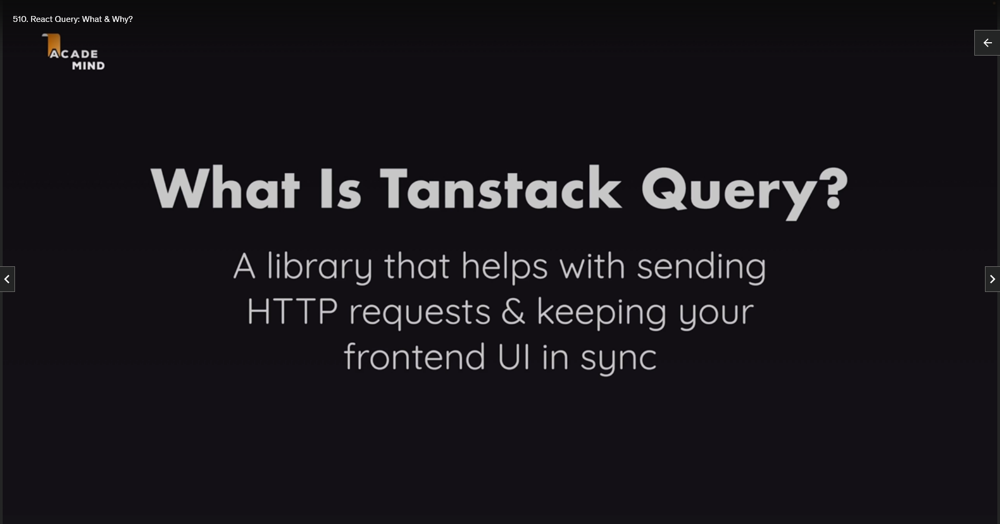
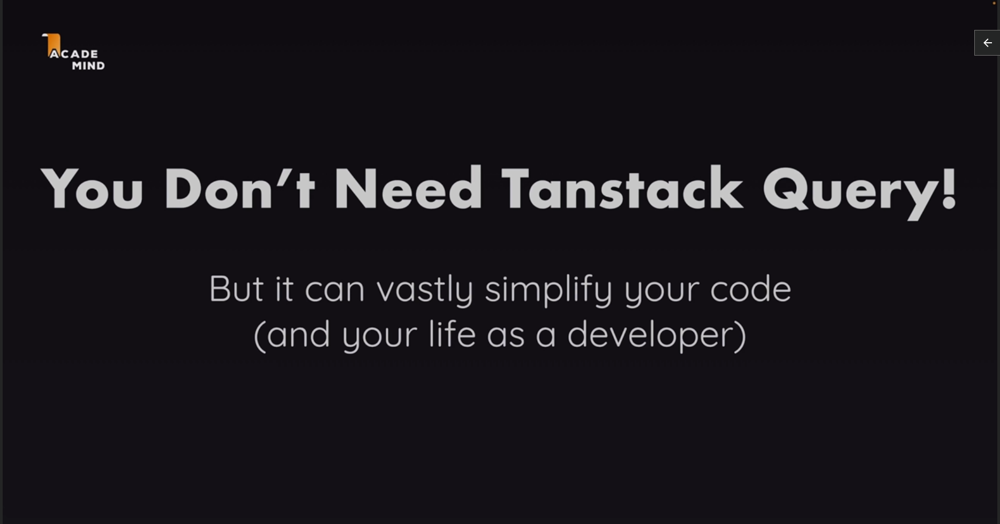

# TanStack Query

## Module Introduction


In this section, we're going to work on yet another new project, and whilst working on this project, you will learn how to use TanStack Query, a third-party React library, formerly known as React Query, so that's its old name, the new name is TanStack Query, and it is a library that helps you with sending HTTP requests from inside your React app. So it helps you with connecting your React frontend to a backend.

Now, of course, in this course, you already learned how to do that, for example, with useEffect and using the built-in fetch function that's provided by the browser, but in this section here, you will learn what exactly TanStack Query is, and most importantly, why you would use it instead of using `useEffect` and `fetch`, for example.

And you will then learn how to use this TanStack Query library to fetch data and to mutate data, so how to send, get, and post, and put, and delete requests, and all these things. You will learn how to configure and efficiently use this library, and we will also explore many more advanced concepts like working with the cache that's provided by that library, how it works, and how you can invalidate and change it.

We'll explore the topic of optimistic updating, what that is, and how you would implement it with TanStack Query, and much more.

## TanStack Query: What & Why?





Before we delve into utilizing TanStack Query in this project, it's crucial that we all have a clear understanding of what TanStack Query is and the reasons for considering its use. As highlighted in the initial video of this section, TanStack Query serves as a library designed to facilitate the management of HTTP requests and ensure synchronization between the frontend user interface and backend data.

The fundamental concept revolves around sending HTTP requests and maintaining coherence between the frontend and backend. It's essential to note that while TanStack Query streamlines this process, it is not a prerequisite. Achieving the same result is feasible using tools like the `useEffect` hook and the `fetch` function, as demonstrated earlier in this course.

TanStack Query, however, offers a significant advantage in simplifying code, potentially enhancing the developer's experience. This is particularly notable due to the library's inclusion of numerous built-in advanced features. These features prove invaluable for more intricate React applications, addressing challenges that would otherwise be laborious to tackle independently.

In the repository, specifically within the `src/components/Events` directory, you'll encounter a component named `NewEventsSection`. In the corresponding file, the useEffect hook is employed to execute code responsible for sending an HTTP request to the backend and retrieving events data. The component manages states for data, potential errors, and loading indicators to update the UI accordingly.

```js
// src/components/Events/NewEventsSection.jsx
import { useEffect, useState } from "react";

import LoadingIndicator from "../UI/LoadingIndicator.jsx";
import ErrorBlock from "../UI/ErrorBlock.jsx";
import EventItem from "./EventItem.jsx";

export default function NewEventsSection() {
  const [data, setData] = useState();
  const [error, setError] = useState();
  const [isLoading, setIsLoading] = useState(false);

  useEffect(() => {
    async function fetchEvents() {
      setIsLoading(true);
      const response = await fetch("http://localhost:3000/events");

      if (!response.ok) {
        const error = new Error("An error occurred while fetching the events");
        error.code = response.status;
        error.info = await response.json();
        throw error;
      }

      const { events } = await response.json();

      return events;
    }

    fetchEvents()
      .then((events) => {
        setData(events);
      })
      .catch((error) => {
        setError(error);
      })
      .finally(() => {
        setIsLoading(false);
      });
  }, []);

  let content;

  if (isLoading) {
    content = <LoadingIndicator />;
  }

  if (error) {
    content = (
      <ErrorBlock title="An error occurred" message="Failed to fetch events" />
    );
  }

  if (data) {
    content = (
      <ul className="events-list">
        {data.map((event) => (
          <li key={event.id}>
            <EventItem event={event} />
          </li>
        ))}
      </ul>
    );
  }

  return (
    <section className="content-section" id="new-events-section">
      <header>
        <h2>Recently added events</h2>
      </header>
      {content}
    </section>
  );
}
```

While this approach utilizing React's built-in features is entirely valid, it does present potential flaws. The code can be extensive, requiring meticulous state management within each component handling HTTP requests. Even with the possibility of simplification through custom hooks, certain features may be missing or problematic.

For instance, the current code lacks a mechanism for triggering a refetch when returning to the website after navigating to a different tab. Additionally, the absence of caching functionality could result in redundant data fetching when switching between pages, hindering the user experience. Implementing these features from scratch demands significant effort and precision.

This is where TanStack Query becomes instrumental. The library not only streamlines existing code, such as state management, but also introduces advanced features like caching and automatic data fetching upon revisiting the website. These subtle enhancements contribute to a more efficient and user-friendly application. Now, let's embark on our journey with TanStack Query to leverage its capabilities and improve our app.

## Install & Using TanStack Query - And Seeing Why It's Great!

## Understanding & Configuring Query Behaviours - Cache & Stale Data

## Dynamic Query Functions & Query Keys

## The Query Configuration Object & Aborting Requests

## Enabled & Disabled Queries

## Changing Data with Mutations

## Fetching More Data & Testing the Mutation

## Acting on Mutation Success & Invalidating Queries

## A Challenge! The Problem

## A Challenge! The Solution

## Disabling Automatic Refetching After Invalidations

## Enhancing the App & Repeating Mutation Concepts

## React Query Advantages in Action

## Updating Data with Mutations

## Optimistic Updating

## Using the Query Key as Query Function Input

## React Query & React Router
